# Portfolio Diversifier
Portfolio Diversifier helps retail customers easily analyze the diversification value of any ticker using WARP and other ratios and provides recommendations based on WARP. It also allows the customers to forecast the portfolio performance using Monte Carlo

* Shows why sharpe is not a good tool to pick tickers for diversification
* What is WARP and why WARP is a better tool to pick tickers for diversification
* Analyze the 2008 to 2020, 2008 to 2009, 2020 historical market data to show that tickers picked for diversification using WARP perform better than the market and the tickers picked using Sharpe
* Identifies tlt as the best diversifiers out of a list of diversifiers
* Forecast results 5 years into the future for a portfolio based on the best diversifier using Monte Carlo simulations.
* Implements a UI using Questionary to allow retail customer to easily navigate their diversification requirements in a guided manner with recommendations.
* Dash visualizes the Risk Return Ratios, Cumulative Returns and Forecasting analysis. 
* Identify the target customers for the application.

## Why not use Sharpe for picking stocks:

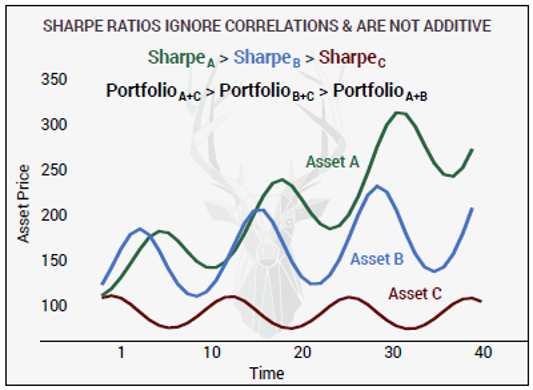
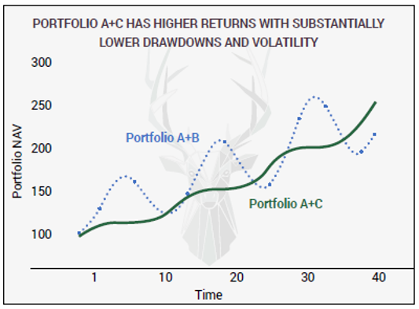

## What is the solution? WARP (Win Above Replacement Portfolio - courtesy Artemis Capital Management):

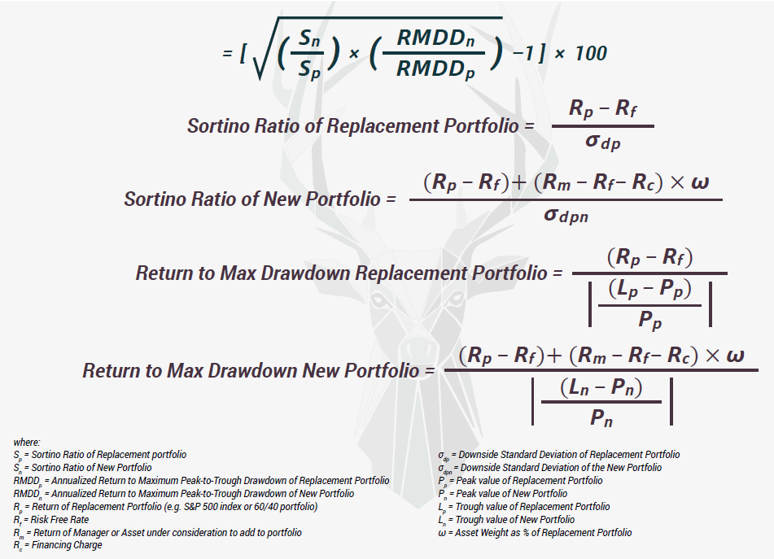

#### WARP > 0 
##### ASSET IS IMPROVING YOUR PORTFOLIO BY INCREASING: 
######            * 1. Return to Downside Volatility; 
######            * 2. Return to MAX Drawdown; 
######            * 3. Or BOTH. 
#### WARP < 0 
##### ASSET HURTS YOUR PORTFOLIO BY REPLICATING EXISTING EXPOSURES AND/OR INCREASING DRAWDOWNS AND VOLATILITY.

## Picking Stocks based on WARP vs Sharpe:

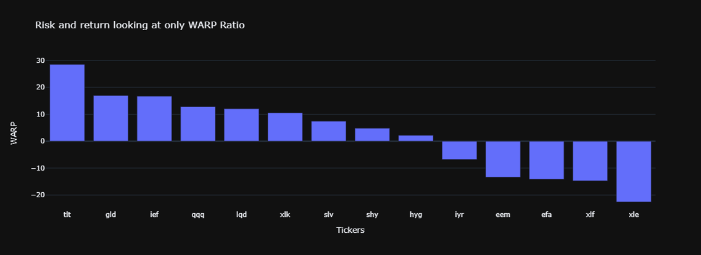

#### WARP > 0 
##### ASSET IS IMPROVING YOUR PORTFOLIO BY INCREASING: 
######            * 1. Return to Downside Volatility; 
######            * 2. Return to MAX Drawdown; 
######            * 3. Or BOTH. 
#### WARP < 0 
##### ASSET HURTS YOUR PORTFOLIO BY REPLICATING EXISTING EXPOSURES AND/OR INCREASING DRAWDOWNS AND VOLATILITY.

Based on WARP, tlt and gld look promising for diversification needs

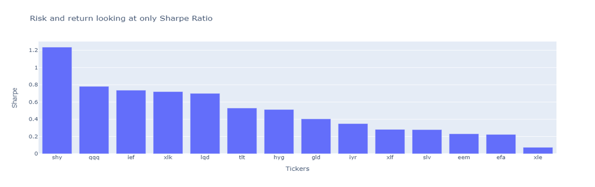

Based on Sharpe, shy looks promising for diversification needs. 

## Diversifers identified from a known list
* tlt - 20+ Year Treasury Bond ETF (Identified using WARP)
* shy - 1-3 Year Treasury Bond ETF (Identified using Sharpe)
* gld - Gold ETF (Identified using WARP)

## Analyzing stocks historically:

portfolio mixing 20% tlt (picked based on WARP) with 80% spy performs better than portfolio mixing 20% shy (picked based on Sharpe) with 80% spy

### 2008 to 2020:
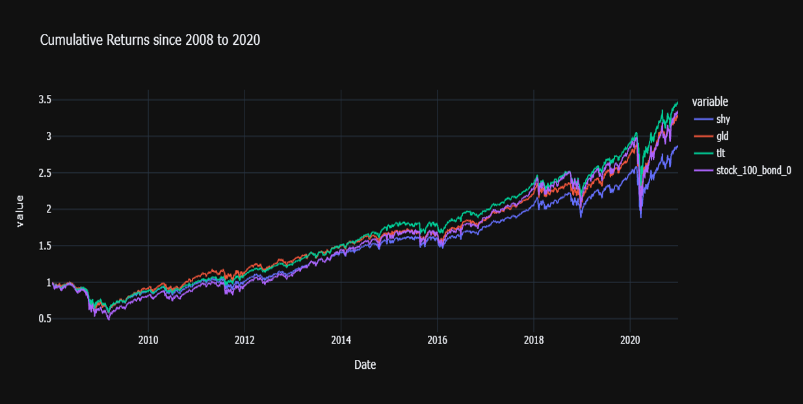

### 2008 to 2009:
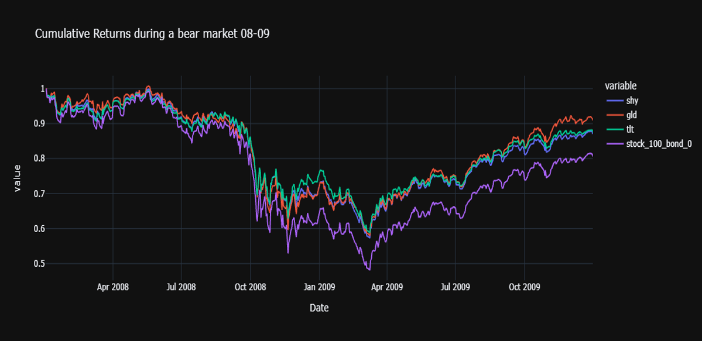

### 2020:
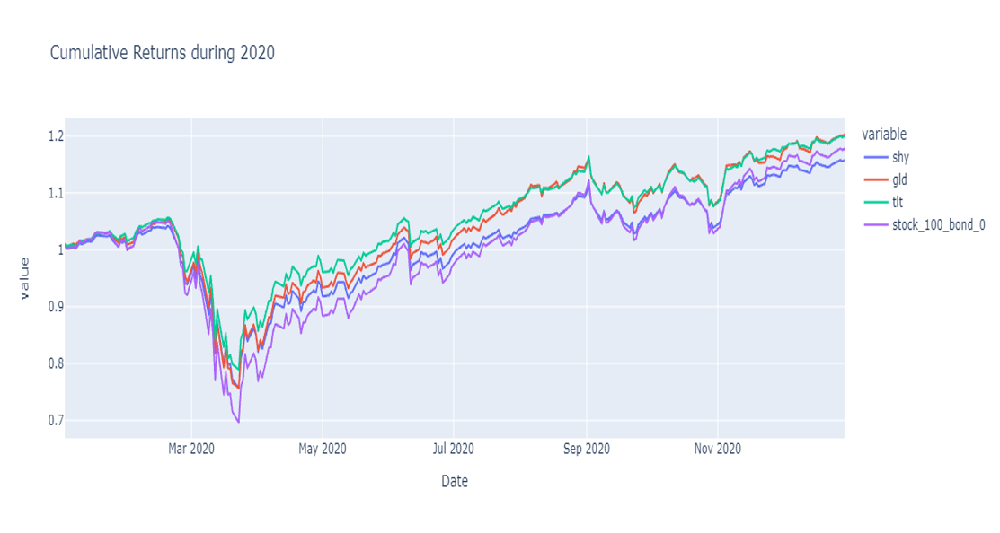

Historical analysis shows that tlt is the best diversifier performing better than shy and providing more downside protections than shy. Portfolio consisting of 80% S&P 500 and 20% tlt performs better than the S&P 500

## Forecasting for a 20% tlt (best diversifier from historical analysis) 48% spy 32% ier portfolio using Monte Carlo - 
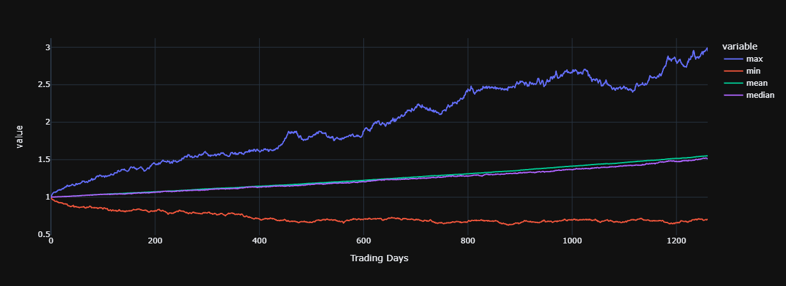

* count        - 500 
* mean         - 1.55 
* std          - 0.37
* min          - 0.69 
* 25%          - 1.29 
* 50%          - 1.51 
* 75%          - 1.76 
* max          - 2.95 
* 95% CI Lower - 0.91 
* 95% CI Upper - 2.41

There is a 95% chance that an initial investment of $10,000 in the tlt based portfolio Returns $9071.96 to $24128.53

## Identifying Target Customers for the MVP:

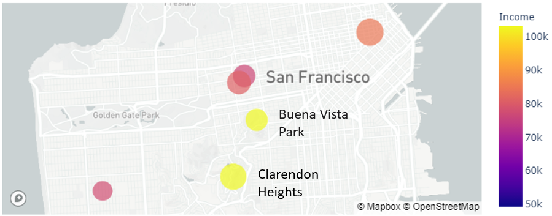

Buena Vista Park and Clarendon Heights are the ideal neighborhoods based on income and population for our initial targetting of customers.

## UI Flow:

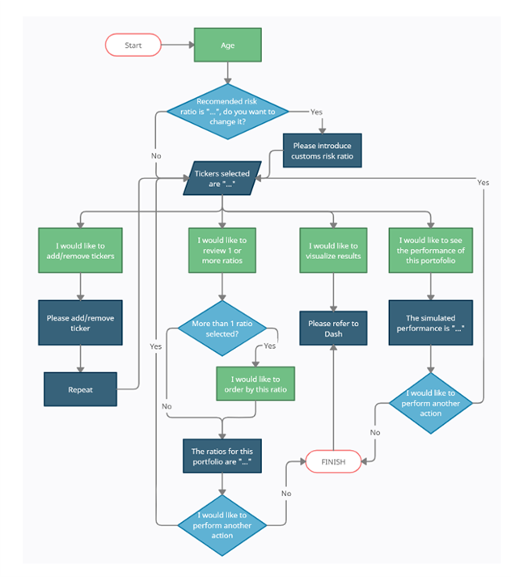

## Dash Output:

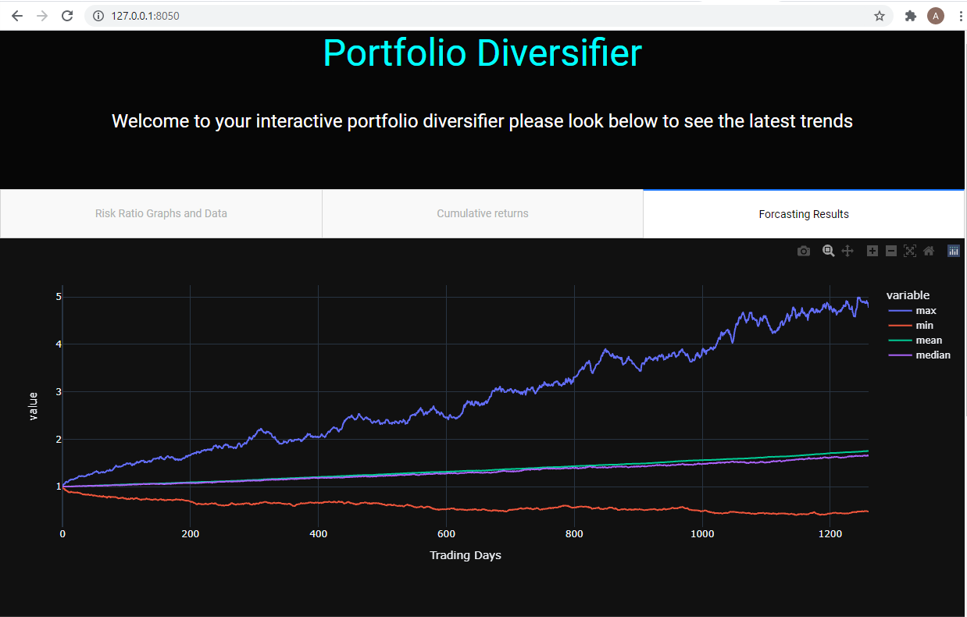

## Planned Additions/Future Enhancements/Next Steps

* Portfolio rebalancing on a daily/monthly basis
* Portfolio optimization based on tickers selected.
* More UI Flexibility
* Explore long volatility and other funds as diversifiers
* Add more ratios such as Treynor, Information, etc. for comparison and ticker picking.
* Provide more flexibility is picking tickers for analysis.
* Launch Full Web Application
* Integrate questionary/UI with Dash
* Make daily updated on ratios.
* Release the MVP to the early adopters
* Productize the MVP & Make it web based
* Add Customized Portfolios & recursively add portfolios
* Tiered Pricing with Premium Personal & Specialized Support                                            
* Add options to change portfolio weights.  

## Conclusions

* Out of the diversifiers tlt performs best
* portfolio mixing 20% tlt (picked based on WARP) with 80% spy performs better than portfolio mixing 20% shy (picked based on Sharpe) with 80% spy
* WARP is the best ratio to identify best diversifiers.
* WARP allows us to easily identify a good diversifier and does not suffer from some of the flaws of common ratios such as Sharpe
* Sharpe is not a good way to identify tickers for diversification.
* Diversifiers identified by WARP perform better than market and diversifiers identified using other ratios such as Sharpe, etc. 
* Buena Vista Park and Clarendon Heights in San Francisco are ideal initial neighborhoods to target customers for this application.
* Questionary and Dash provide a seamless UI/Front end experience for customers to easily navigate through their diversifications requirements and can provide a guided experience with recommendations.

## Power point presentation/Slide Deck
* [Power Point/Slide Deck](https://github.com/sangramsinghg/portfolio_diversifier/blob/main/Portfolio_Diversifier.pptx?raw=true) - Power Point Slide Deck.

---

## Technologies

This project uses python 3.7 along with the following packages:

* [JupyterLab](https://jupyterlab.readthedocs.io/en/stable/) - Web based user interface for data analysis.

* [pandas](https://github.com/pandas-dev/pandas) - Data analysis and manipulation library.

* [Dash](https://dash.plotly.com/) - Dash is a productive Python framework for building web analytic applications.

* [Yfinance](https://pypi.org/project/yfinance/) - reliable, threaded, and Pythonic way to download historical market data from Yahoo! finance.

* [hvplot](https://hvplot.holoviz.org/) - hvPlot provides a high-level plotting API built on HoloViews that provides a general and consistent API for plotting data

* [Questionary](https://pypi.org/project/questionary/) - Questionary is a Python library for effortlessly building pretty command line interfaces

* [Numpy](https://numpy.org/) - NumPy brings the computational power of languages like C and Fortran to Python

* Monte Carlo - Forecasting data to the future.
---

## Installation Guide

Please install the following before starting the application

```python
  pip install jupyterlab
  pip install pandas
  pip install dash
  pip install dash_core_components
  pip install dash_html_components
  pip install pandas
  pip install plotly
  pip install dash_bootstrap_components
  pip install dash_table
  pip install pathlib
  pip install fire
  pip install questionary 
  pip install hvplot
  pip install datetime
  pip install numpy
  pip install yfinance

```
In case of issues, please see the requirements.txt for a complete list of packages with versions needed to run this application

For problems with the installation:
```python
  conda deactivate
  conda install ipykernel -y
  conda create -n pyvizenv python=3.7 -y
  conda activate pyvizenv
  conda install -c conda-forge jupyterlab=2 -y
  conda install -c plotly plotly=4.13. -y
  conda install -c pyviz hvplot -y
  conda install -c conda-forge nodejs=12 -y
  conda install streamz -y
  pip install python-dotenv decorator==4.3 networkx
  conda install nb_conda_kernels ipykernel -y
  jupyter labextension install jupyterlab-plotly@4.13.0 --no-build
  jupyter labextension install @jupyter-widgets/jupyterlab-manager plotlywidget@4.13.0 --no-build
  jupyter labextension install @pyviz/jupyterlab_pyviz --no-build
  conda list plotly
  conda list hvplot
  conda list nodejs
```
---

## Usage

```python
python portfolio_diversifier_ui.py
```
Command Line Usage:
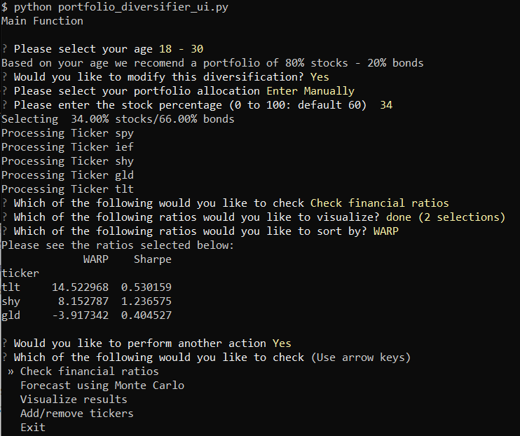

* NOTE: the user needs to run the portfolio_diversifier_ui.py before running the dash below
* NOTE: The dash needs to be run after "Forecast using Monte Carlo" function (as shown in the output above) has been run in the portfolio_diversifier_ui.py

To launch web output using Dash:
```python
python <full path of the portfolio diversifier folder>/portfolio_diversifier_ui_dash_db.py

example:
python 'C:\Users\sangrams\git\portfolio_diversifier\portfolio_diversifier_ui_dash_db.py'
```

Dash Usage:


---

## Contributors

* Sangram Singh (sangramsinghg@yahoo.com)
* Dylan Bowsky
* Rodrigo Monge
* George Kraft

---

## License

MIT